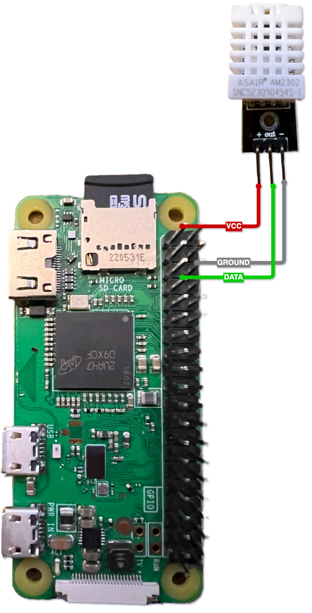

# 🌡 Raspberry Pi Temperature and Humidity API 🌦

Turn your Raspberry Pi into a mini weather station! This guide will help you set up an API to read temperature and humidity data from a DHT22/AM2302 sensor.

## 📝 Table of Contents

- [🌡 Raspberry Pi Temperature and Humidity API 🌦](#-raspberry-pi-temperature-and-humidity-api-)
  - [📝 Table of Contents](#-table-of-contents)
  - [📋 Prerequisites](#-prerequisites)
  - [🔌 Hardware Setup](#-hardware-setup)
  - [💾 Manual Software Setup](#-manual-software-setup)
  - [🚀 Production Deployment](#-production-deployment)
  - [🚗 Auto-Start on Boot](#-auto-start-on-boot)
  - [📜 Using the Installation Script](#-using-the-installation-script)
    - [How to Use](#how-to-use)
    - [Pros](#pros)
    - [Cons](#cons)
  - [🔗 Accessing the API](#-accessing-the-api)
  - [🔒 Security](#-security)

## 📋 Prerequisites

- Raspberry Pi Zero with Raspbian OS installed.
- DHT22/AM2302 sensor with 3-pin configuration.
- Internet connection.

## 🔌 Hardware Setup

1. **Connect the DHT22/AM2302 sensor** to the Raspberry Pi Zero:

   

   - **VCC** to **3.3V** or **5V**
   - **Data** to **GPIO4**
   - **GND** to **GND**

## 💾 Manual Software Setup

1. **Open a terminal** on your Raspberry Pi.

2. **Update your Pi**:

   ```bash
   sudo apt-get update
   ```

3. **Install necessary packages**:

   ```bash
   sudo apt-get install python3-pip nginx
   ```

4. **Install Python libraries**:

   ```bash
   pip3 install Adafruit_DHT Flask gunicorn
   ```

5. **Set up the API**:
   - Copy the `temp_humidity_api.py` to your desired directory; it is the only file you need.

   - ```bash
     mkdir -p /home/pi/temp_humidity_api
     mv temp_humidity_api.py /home/pi/temp_humidity_api
     ```

6. **Test the API**:

   ```bash
   python3 temp_humidity_api.py
   ```

   Your API should now be running on `http://0.0.0.0:5000/metrics`.

## 🚀 Production Deployment

1. **Set up Gunicorn**:
   - Gunicorn will serve the Flask application. Start it with the following to test from your API directory:

     ```bash
     gunicorn -w 4 temp_humidity_api:app -b 0.0.0.0:8000
     ```

2. **Set up Nginx**:
   - Create a new Nginx configuration:

     ```bash
     sudo nano /etc/nginx/sites-available/temp_humidity_api
     ```

   - Add the following configuration

     - Replace `your_ip_range` with your desired IP range, e.g., `192.168.1.0/24` for access

     - Replace `your_pi_ip_address` with your Raspberry Pi IPv4 Address

     ```nginx
     server {
         listen 80;
         server_name your_pi_ip_address;
     
         location / {
             allow your_ip_range;
             deny all;
     
             proxy_pass http://127.0.0.1:8000;
             proxy_set_header Host $host;
             proxy_set_header X-Real-IP $remote_addr;
         }
     }
     ```

   - Link the Nginx configuration and restart Nginx:

     ```bash
     sudo ln -s /etc/nginx/sites-available/temp_humidity_api /etc/nginx/sites-enabled
     sudo nginx -t
     sudo systemctl restart nginx
     ```

## 🚗 Auto-Start on Boot

1. **Create a `systemd` service file**:

   ```bash
   sudo nano /etc/systemd/system/temp_humidity_api.service
   ```

2. **Add the following configuration**

   1. Replace `/path/to/your/directory` with the path to your `temp_humidity_api.py` file

   2. Replace `/path/to/gunicorn` where gunicorn is located (try `which gunicorn`)

   3. `your_username` is the user account the API will run under. *Don't use root!*

   ```ini
   [Unit]
   Description=Temperature and Humidity API
   After=network.target
   
   [Service]
   User=your_username
   WorkingDirectory=/path/to/your/directory
   ExecStart=/path/to/gunicorn -w 4 temp_humidity_api:app -b 0.0.0.0:8000
   Restart=always
   
   [Install]
   WantedBy=multi-user.target
   ```

3. **Enable and start the service**:

   ```bash
   sudo systemctl enable temp_humidity_api.service
   sudo systemctl start temp_humidity_api.service
   ```

## 📜 Using the Installation Script

The `install_api.sh` script is designed to automate the setup process described above. It's especially useful if you're setting up multiple Raspberry Pis or want a quick, hassle-free installation. The idea is that you are installing on a freshly imaged Raspbian Linux image.

### How to Use

1. Download or copy the `install_api.sh` script to your Raspberry Pi to the same directory as `temp_humidity_api.py`.
2. Make the script executable: `chmod +x install_api.sh`
3. Run the script: `./install_api.sh`
4. You will be asked for two items
   1. The IP range to allow access to the API such as `192.168.20.0/24` or `10.0.0.0/22`. The default is `192.168.1.0/24`
   2. The port to run the API on. The default is `8000`.

### Pros

- **Efficiency**: The script automates multiple steps, saving time.
- **Consistency**: Ensures the same setup process every time, reducing potential errors.

### Cons

- **Less Control**: While the script provides some configurability, manual setup offers more control over each step.
- **Understanding**: If you're new to Linux or Raspberry Pi, running scripts without understanding them can be risky. Always review script contents before executing.

## 🔗 Accessing the API

Once everything is set up, you can access the API using:

```text
http://your_pi_ip_address:port/metrics
```

This will return a JSON response with temperature and humidity data.

```bash
[23:31:40] ~ $ curl localhost:8000/metrics
{"humidity":52.400001525878906,"temperature_celsius":21.899999618530273,"temperature_fahrenheit":71.4199993133545}
```

## 🔒 Security

The Nginx configuration provided restricts access to a specific IP range for added security. Ensure you configure this range according to your needs. Do not expose this API to the Internet. Do not run this API as root.
